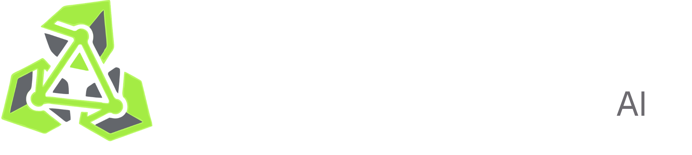

# Autonomous Red-Team & Enterprise Monitoring Intelligence System

<p align="center">
  
</p>

## Table of Contents
1. [About Artemis](#1-about-artemis)
2. [Core Features](#2-core-features)
3. [Architectural Overview](#3-architectural-overview)
4. [Prerequisites](#4-prerequisites)
5. [Docker Deployment Guide](#5-docker-deployment-guide)
6. [Local Development Deployment](#6-local-development-deployment)
7. [Codebase Anatomy & Subsystems](#7-codebase-anatomy--subsystems)
8. [Agent Configurations](#8-agent-configurations)
9. [Environment Configuration Reference](#9-environment-configuration-reference)
10. [Integrations (Slack & Jira)](#10-integrations-slack--jira)
11. [Troubleshooting](#11-troubleshooting)
12. [License](#12-license)

---

## 1. About Artemis
Artemis is a comprehensive, multi-agent AI-powered cybersecurity platform designed for autonomous offensive penetration testing and real-time defensive Security Information and Event Management (SIEM) monitoring. Built upon the Agent Development Kit (ADK) and powered by Large Language Models (such as Google Gemini and local models natively via Ollama), Artemis systematically evaluates network infrastructures, tracks vulnerabilities, and identifies structural defense shortcomings in an automated continuous loop.

## 2. Core Features
- **Autonomous Penetration Testing**: Deploys a Red Team agent capable of intelligently chaining Kali Linux tooling (e.g., Nmap, Metasploit, SearchSploit, Nuclei, Nikto) over isolated execution services. The agent can asynchronously manage long-running background listeners (like Netcat).
- **CVE Intelligence Pipeline**: Scheduled agents automatically fetch incoming High/Critical CVEs from the National Vulnerability Database (NVD), harvest Proof-of-Concept exploits across GitHub and ExploitDB, and correlate them against discovered topography.
- **Real-Time Blue Team Monitoring**: Communicates with the Wazuh SIEM REST API to correlate live telemetry and logs, intelligently classifying alerts and proposing Custom Detection Rules.
- **Human-in-the-Loop Governance**: Integrates a robust approval queue that pauses critical or destructive agent activity sequences until they receive explicit authorization from security engineers.
- **Immutable Distributed Auditing**: Employs PostgreSQL database constraints (Triggers and Hyper-tables) to construct a cryptographically stringent, unalterable log of all agent tool utilization.
- **Real-Time SSE Feeds**: Server-Sent Events systematically broadcast live command outputs and agent communication matrices dynamically directly into the Next.js React Dashboard, featuring structured TTY terminal parsing for offensive security proofs.

## 3. Architectural Overview
Artemis operates via an explicitly segmented 5-layer technological stack to maintain security, resilience, and horizontal scaling.

- **Layer 5 (Presentation)**: Next.js 15 Application utilizing React App Routers and Server Components. Provides visual dashboards for Alert Triage, Campaign status, and Intelligence queues.
- **Layer 4 (Agentic Orchestration)**: Google ADK orchestration layer driving four independent Node.js-based LlmAgents (Orchestrator, Red Team, Blue Team, CVE Intel). 
- **Layer 3 (Tool Execution)**: External communication layer bridging the Agents to the `Kali Execution Service` (REST FastApi wrapper), `Wazuh API`, and OSINT databases.
- **Layer 2 (Data & Messaging)**: Primary PostgreSQL 17 relational datastore leveraging TimescaleDB for time-series events, paired with a Redis 7 cluster for asynchronous Pub/Sub and Job-queuing structures.
- **Layer 1 (Target Infrastructure)**: Fully segregated Docker Bridge Networks isolating malicious vulnerability targets (DVWA, Metasploitable) strictly to the authenticated Kali Execution container.

## 4. Prerequisites
The following dependencies should be installed for host deployments:
- **Node.js**: Version 24.13.0 or higher
- **NPM**: Version 11 or higher
- **Docker Desktop / Engine**: Latest compatible version
- **Google AI Studio API Key**: Required for Gemini Pro inference fallback.

**Optional Extensions**:
- **Ollama**: Required only if substituting cloud inferences for localized LLMs (e.g. `minimax-m2.7:cloud`).
- **NVD API Key**: Dramatically increases rate limits during CVE discovery.
- **GitHub Token**: Grants exhaustive capabilities for repository scanning of PoCs.
- **Shodan API Key**: Enables deeper search parameters via Shodan API for reconnaissance and external visibility.

## 5. Docker Deployment Guide
The production methodology leverages Docker Compose to instantiate the entire unified platform.

### Initialization
Clone the repository and prepare the environment template:
```bash
git clone <repo-url> && cd Artemis
cp .env.example .env
```
Ensure you rigorously configure your variables within `.env` (See the Environment Configuration chapter).

### Deployment
Bring up the entire orchestrated platform with a single command (Building the dependencies will take 15-30 minutes):
```bash
docker compose up -d --build
```

Inorder to reset the data
```bash
docker compose stop postgres && docker compose rm -f postgres && docker volume rm Artemis_postgres_data
docker compose up -d
```

> **Note:** The PostgreSQL database will automatically initialize all required schemas (`/docker-entrypoint-initdb.d/`). The orchestrated dependency graph ensures that the Node.js applications wait for the database, Redis, and Kali service to become fully healthy before starting.

The Administrator Dashboard is now accessible at `http://localhost:3000`.

## 6. Local Development Deployment
If you require active debugging, live reloading, or localized dependency execution.

1. Ensure the databases and execution layers are established via docker:
```bash
docker compose up -d postgres redis kali-service wazuh-manager
```
2. Install Workspace dependencies globally across the monorepo:
```bash
npm install
```
3. Boot the Next.js React frontend:
```bash
npm run dev --workspace=admin-panel
```
4. Transpile and instantiate the respective AI Agents:
```bash
npm run build --workspace=agents

# Instantiate agents independently across terminal panes
npm run start:campaign-handler --workspace=agents
npm run start:blue-team --workspace=agents
npm run start:cve-intel --workspace=agents
```

## 7. Codebase Anatomy & Subsystems

### `admin-panel/`
The Next.js 15 Web Application.
- `app/`: Houses Next.js server actions, page routing, API handlers, and React Server Components. Live agent feeds are mapped here by subscribing to Redis channels and establishing SSE response pipelines.
- `components/`: Contains discrete modular UX components (Charts, Cards, Topology Trees) built upon Tailwind and standard library UX packages.

### `agents/`
The Core Brain architecture.
- `shared/`: Carries globally scoped utility schemas, database singletons (PG/Redis), and the Audit Logger middleware.
- `orchestrator/`: Monitors the Redis `campaign_requests` queue. Moderates the logical sequencing and parses approval requirements prior to executing the sub-agents.
- `red-team/`: Directly interacts with the Kali API layer implementing strict input validations and dynamically resolving scanning findings into PostgreSQL relational items.
- `blue-team/`: Consistently polls the localized Wazuh implementation analyzing rule triggers, mitigating False-Positives via statistical algorithms, and appending actionable incidents.
- `cve-intel/`: Executes purely on interval schedules fetching JSON APIs to maintain updated threat intelligence caches.

### `kali-service/`
The Python FastAPI Execution Layer. 
- Designed explicitly to run purely within an isolated Docker layer containing native Pentesting tools. Exposes REST commands securely via authenticated headers, providing asynchronous background job execution capabilities (e.g. tracking reverse shell listeners), and orchestrates robust Pexpect TTY sessions capable of auto-healing Metasploit consoles and parsing complex interactive payloads.

### `db/` and `infra/`
Contains architectural configurations.
- `db/schema.sql`: Authoritative blueprint of relations and hyper-tables.
- `infra/wazuh`: Specialized custom alerting XML files restricting anomalous activities to the target environments.
- `infra/target-lab`: An encapsulated Docker stack launching explicitly vulnerable systems like DVWA, Apache servers natively configured for direct Path-Traversal Remote Code Executions, alongside patched Decoy targets, solely attached to internal execution network configurations.

## 8. Agent Configurations

Artemis permits precise manipulation of its Large Language Model operations. The core routing algorithm supports an automated hierarchy evaluating configurations provided.

By default, supplying `OLLAMA_API_BASE` shifts generation execution across to an internal Ollama container. If inference strictly demands Google Gemini infrastructure, enforce the variable `ARTEMIS_LLM_PROVIDER=gemini`.

**Internal Workflow Rules**:
1. If provider equals `gemini`, `GEMINI_MODEL` assumes standard Google string assignments (`gemini-2.5-pro`).
2. If provider equals `ollama`, `GEMINI_MODEL` utilizes localized model tags (`llama3`, `minimax-m2.7:cloud`).
3. If provider equals `auto` (Default), initialization defaults towards Ollama configurations when the API Base parameter exists, cleanly falling back to Gemini appropriately.

## 9. Environment Configuration Reference

| Parameter | Required | Default | Definition |
|-----------|----------|---------|------------|
| `GOOGLE_API_KEY` | Yes* | — | Primary Google Studio authentication context. (*Not required strictly under Ollama overrides).* |
| `GOOGLE_GENAI_API_KEY` | Yes* | — | Required redundancy for Google SDKs. |
| `GEMINI_MODEL` | Yes | `gemini-2.5-pro` | Name of the generative AI model format. |
| `ARTEMIS_LLM_PROVIDER` | No | `auto` | Enforces the API protocol standard (`auto`, `gemini`, `ollama`). |
| `OLLAMA_API_BASE` | No | — | Target host URI exposing standard LLM inference completion paths (e.g. `http://host.docker.internal:11434`). |
| `KES_URL` | No | `http://localhost:8001` | Physical route toward the Kali Container service. |
| `KES_SECRET` | Yes | — | Encrypted handshake ensuring untrusted execution calls cannot target the Kali layer. |
| `POSTGRES_DB` | Yes | `artemis` | Default relation store. |
| `DATABASE_URL` | Yes | — | Combined URI Connection string bridging the node applications to PostgreSQL instances. |
| `REDIS_URL` | Yes | `redis://localhost:6379` | Message brokering target. |
| `NVD_API_KEY` | No | — | NVD credential structure. |
| `GITHUB_TOKEN` | No | — | GITHUB credential structure. |
| `SHODAN_API_KEY` | No | — | SHODAN reconnaissance credential structure. |
| `JIRA_CLIENT_ID` | No* | — | Atlassian OAuth 2.0 client ID for Jira Cloud. Required to use Jira integration. |
| `JIRA_CLIENT_SECRET` | No* | — | Atlassian OAuth client secret (pair with `JIRA_CLIENT_ID`). |
| `JIRA_REDIRECT_URI` | No | `{NEXTAUTH_URL}/api/integrations/jira/callback` | Must match the callback URL configured in the Atlassian developer app. |
| `SLACK_CLIENT_ID` | No* | — | Slack app client ID. Required to use Slack integration. |
| `SLACK_CLIENT_SECRET` | No* | — | Slack app client secret. |
| `SLACK_SIGNING_SECRET` | No* | — | Verifies Slack interactive requests. Strongly recommended in production; see [integrations-docs/INTEGRATIONS.md](integrations-docs/INTEGRATIONS.md). |
| `SLACK_REDIRECT_URI` | No | `{NEXTAUTH_URL}/api/integrations/slack/callback` | Must match the OAuth redirect URL in the Slack app settings. |

\*Required only if you enable that integration.

## 10. Integrations (Slack & Jira)

Artemis can push **security incidents** and **human-in-the-loop approval requests** into external workflows: **Jira Cloud** for ticketing and traceability, and **Slack** for real-time alerts and **Approve / Deny** buttons that update the approval queue without opening the dashboard.

### What each integration does

- **Jira**: When an incident is recorded, the system can create a Jira issue in a configured project (summary prefixed with `[Artemis]`). Links are stored so resolving the issue in Jira can mark the incident resolved in Artemis, and resolving the incident can move the Jira issue toward **Done**.
- **Slack**: Subscribes to the same event stream: incident posts (blocks + dashboard links) and approval requests with interactive actions. Slack **Signing Secret** secures the interactive endpoint.

### How it is wired

1. **OAuth** in the admin panel stores workspace tokens in PostgreSQL (`jira_connections`, `slack_connections` — see migration `db/migrations/006_integrations.sql`).
2. **Redis** channels `new_incident` and `approval_queue` carry lightweight JSON payloads when incidents and approvals are created.
3. On server startup, the admin panel **Node** runtime runs an **integration dispatcher** (`admin-panel/src/instrumentation.ts` → `lib/integrations/dispatcher.ts`) that subscribes to Redis and calls Jira/Slack helpers.

For production, expose **HTTPS** URLs for OAuth callbacks, Slack **Interactivity** (`/api/integrations/slack/interactive`), and the **Jira webhook** (`/api/integrations/jira/webhook`).

### Configure in the UI

After setting environment variables from `.env.example`, sign in to the admin panel:

1. Open **Settings → Integrations** (`/integrations`).
2. Use **Jira** → *Connect Jira* to run Atlassian OAuth, then set **Project key** and **Issue type** on the connection card.
3. Use **Slack** → *Add to Slack*, then set the **Channel ID**, notification toggles, and (for private channels) invite the bot.

### Deeper documentation

Step-by-step vendor console setup (Atlassian app scopes, Slack manifest, webhooks, troubleshooting, and manual sync API) lives here:

**[integrations-docs/INTEGRATIONS.md](integrations-docs/INTEGRATIONS.md)**

A copy of the Slack app manifest for “Create from manifest” is at [integrations-docs/slack-manifest.json](integrations-docs/slack-manifest.json) (adjust redirect and interactivity URLs before use).

## 11. Troubleshooting

### Container Networking Abstractions
When attempting to interface the `agents` Docker Container to a localized host-based LLM instance (Ollama), standard loopback URLs (`http://localhost`) fail resulting in timeouts. Configure your environment variable as `OLLAMA_API_BASE=http://host.docker.internal:11434`. This safely bridges container logic explicitly towards the host machine executing the Local Client.

### Database Timescale Extensibility Issues
When conducting migrations manually, failing to apply the files recursively constructs a relational break. Migration `004_timescale.sql` depends precisely on `timescaledb` extension availability within the Postgres instance. Always rely on `timescale/timescaledb:latest-pg17` image containers to satisfy deployment expectations natively.

### Admin Panel Rendering Desynchronizations
If components within the Admin Panel crash emitting React Hydration mismatch logic (frequently manifesting as a visible white screen after compiling layout blocks), it implies the Client Browser timezone directly contradicts the Node.js UTC server standard. The project mitigates this utilizing specialized `ClientDate` components for hydration boundaries. Avoid introducing raw Javascript Date evaluation mechanisms.

### SSE Stream Connection Resource Limits
When navigating actively across `Campaign` detail routes featuring Auto Refresh cycles, browser networking rules can quickly throttle request limits. Artemis leverages precise React Transitions to deprecate heavy requests minimizing overlapping HTTP connection allocations against underlying Live Feeds. Modifications directly onto Dashboard components should rigorously obey `useTransition` and un-mount lifecycle evaluations when bridging Redis Event channels avoiding complete UI dead-locks.

## 12. License
Private — All rights reserved.
