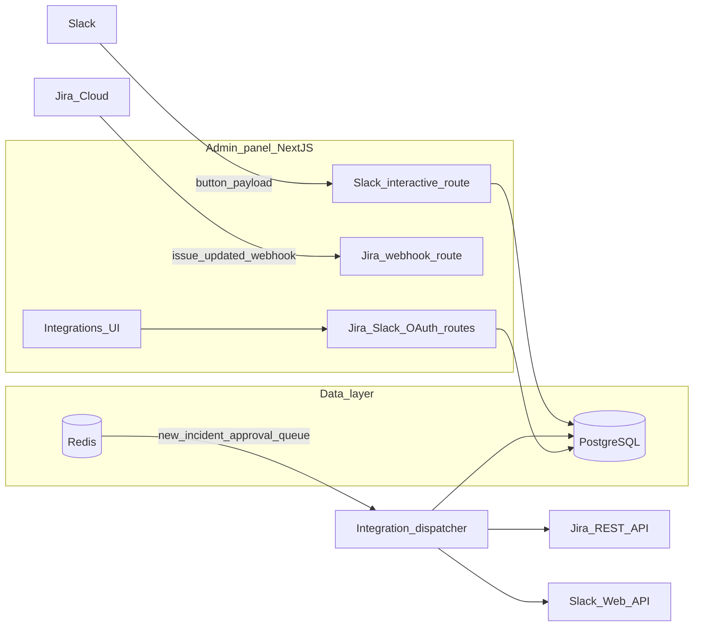

# Athenix integrations: Slack & Jira

This guide covers end-to-end setup for **Slack** (incident alerts, approval notifications, interactive approve/deny) and **Jira Cloud** (automatic issues from incidents, status sync). OAuth credentials and tokens are stored in PostgreSQL; the admin panel exposes OAuth routes and settings UI.

## Contents

1. [Architecture](#1-architecture)
2. [Prerequisites](#2-prerequisites)
3. [Environment variables](#3-environment-variables)
4. [Database](#4-database)
5. [Jira Cloud setup](#5-jira-cloud-setup)
6. [Slack setup](#6-slack-setup)
7. [In-app configuration](#7-in-app-configuration)
8. [Behavior reference](#8-behavior-reference)
9. [Manual sync API](#9-manual-sync-api)
10. [Troubleshooting](#10-troubleshooting)

---

## 1. Architecture

- **UI**: Next.js admin panel under **Settings → Integrations** (`/integrations`, `/integrations/jira`, `/integrations/slack`). Connect buttons hit `/api/integrations/jira/auth` and `/api/integrations/slack/auth` (session required).
- **OAuth callbacks**: Token exchange persists rows in `jira_connections` and `slack_connections`.
- **Event bus**: When incidents or approvals are created, publishers emit JSON on Redis channels **`new_incident`** and **`approval_queue`**.
- **Dispatcher**: On Node server startup, [`admin-panel/src/instrumentation.ts`](../admin-panel/src/instrumentation.ts) loads [`admin-panel/src/lib/integrations/dispatcher.ts`](../admin-panel/src/lib/integrations/dispatcher.ts), which subscribes to those channels and calls Jira sync and Slack notify helpers.

---

## 2. Prerequisites

- **PostgreSQL** with migration **`006_integrations.sql`** applied (tables: `jira_connections`, `slack_connections`, `incident_jira_map`, `approval_slack_map`). This runs with the rest of the schema when using the provided Docker/init flow or migrations.
- **Redis** reachable at `REDIS_URL` (same instance the agents use for pub/sub).
- **Admin panel** running with valid **`NEXTAUTH_URL`** (used as the default base for OAuth redirect URIs when `JIRA_REDIRECT_URI` / `SLACK_REDIRECT_URI` are omitted).
- **HTTPS public URL** in production for Slack interactivity and Jira webhooks (Slack rejects plain `http` except for localhost-style development).

---

## 3. Environment variables

Copy from [`.env.example`](../.env.example) and set the following in the **admin-panel** environment (e.g. root `.env` consumed by Docker or `admin-panel/.env` for local dev).

| Variable | Purpose |
|----------|---------|
| `NEXTAUTH_URL` | Base URL of the admin app (e.g. `http://localhost:3000`). Used to build default OAuth redirect URIs. |
| `JIRA_CLIENT_ID` | Atlassian OAuth 2.0 (3LO) app client ID. |
| `JIRA_CLIENT_SECRET` | Atlassian OAuth client secret. |
| `JIRA_REDIRECT_URI` | Optional override. Default: `{NEXTAUTH_URL}/api/integrations/jira/callback` |
| `SLACK_CLIENT_ID` | Slack app “Client ID”. |
| `SLACK_CLIENT_SECRET` | Slack app “Client Secret”. |
| `SLACK_SIGNING_SECRET` | Used to verify interactive payloads from Slack (`/api/integrations/slack/interactive`). **Required in production**; if unset, signature checks are skipped (development only). |
| `SLACK_REDIRECT_URI` | Optional override. Default: `{NEXTAUTH_URL}/api/integrations/slack/callback` |

`DATABASE_URL` and `REDIS_URL` must match the stores where connections and Redis pub/sub run.

---

## 4. Database

Migration [`db/migrations/006_integrations.sql`](../db/migrations/006_integrations.sql) defines:

| Table | Role |
|-------|------|
| `jira_connections` | OAuth tokens, site URL, Atlassian `cloud_id`, default `project_key` / `issue_type`. |
| `slack_connections` | Bot token, optional default channel, webhook URL, notification toggles. |
| `incident_jira_map` | Links an Athenix `incidents.id` to a Jira issue key/URL. |
| `approval_slack_map` | Links an `approval_requests.id` to a Slack message `ts` for later updates. |

Do not commit real tokens; only the app runtime should read these values.

---

## 5. Jira Cloud setup

### 5.1 Create an Atlassian OAuth 2.0 (3LO) app

1. Open the [Atlassian Developer Console](https://developer.atlassian.com/console/myapps/) and create an **OAuth 2.0 integration**.
2. Under **Permissions**, add Jira API scopes consistent with the code: **`read:jira-work`**, **`write:jira-work`**, **`offline_access`** (see [`admin-panel/src/lib/jira.ts`](../admin-panel/src/lib/jira.ts)).
3. Under **Authorization**, set **Callback URL** to exactly:
   - Local: `http://localhost:3000/api/integrations/jira/callback`
   - Production: `https://<your-admin-host>/api/integrations/jira/callback`
4. Copy **Client ID** and **Secret** into `JIRA_CLIENT_ID` and `JIRA_CLIENT_SECRET`.

### 5.2 Connect from the dashboard

1. Sign in to the admin panel.
2. Go to **Integrations → Jira** and click **Connect Jira** (`/api/integrations/jira/auth`).
3. After consent, you return to the callback handler which stores tokens.

### 5.3 Project and issue type

On the Jira integration card, set **Project key** (e.g. `SEC`) and **Issue type** (`Task`, `Bug`, `Story`, or `Epic`). Incidents are not synced until `project_key` is set.

### 5.4 Webhook (Jira → Athenix)

To resolve Athenix incidents when a Jira issue moves to a terminal status, register a **Jira webhook** (Jira **Settings → System → Webhooks** in Cloud, or equivalent for your site):

- **URL**: `https://<your-admin-host>/api/integrations/jira/webhook`
- **Events**: at minimum **Issue updated** so `jira:issue_updated` deliveries reach the handler.

The handler ([`admin-panel/src/app/api/integrations/jira/webhook/route.ts`](../admin-panel/src/app/api/integrations/jira/webhook/route.ts)) maps `issue.key` through `incident_jira_map` and, when status is one of `done`, `resolved`, `closed`, `complete`, `completed`, sets the incident to **resolved** unless it was already resolved or false positive.

Use HTTPS and restrict the webhook secret if your Jira product supports signing or allowlisting.

---

## 6. Slack setup

### 6.1 Create the Slack app

The repo includes a manifest you can paste into Slack **Create from manifest**:

- [`integrations-docs/slack-manifest.json`](./slack-manifest.json) (source of truth for docs)
- [`admin-panel/public/slack-manifest.json`](../admin-panel/public/slack-manifest.json) (copy for convenience)

Before creating the app, edit the manifest JSON and replace:

- `oauth_config.redirect_urls` with your real callback URL(s).
- `settings.interactivity.request_url` with `https://<your-admin-host>/api/integrations/slack/interactive` (use `http://localhost:3000/...` only for local dev).

**Bot token scopes** in code match the manifest: `chat:write`, `channels:read`, `channels:join`, `groups:read`, `incoming-webhook` (see [`getSlackAuthUrl` in `admin-panel/src/lib/slack.ts`](../admin-panel/src/lib/slack.ts)).

### 6.2 App credentials

From **Basic Information**:

- Copy **Signing Secret** → `SLACK_SIGNING_SECRET`.
- From **OAuth & Permissions**, copy **Client ID** / **Client Secret** → `SLACK_CLIENT_ID` / `SLACK_CLIENT_SECRET`.

### 6.3 Install to workspace

Use **Integrations → Slack → Add to Slack** (`/api/integrations/slack/auth`). After install, open the connection card and set:

- **Channel ID** (e.g. `C0123456789`) and optional display name.
- Toggles for **incident** and **approval** notifications.

The bot tries to **join** public channels when posting if it receives `not_in_channel`; for private channels, **invite the bot** (`/invite @YourBotName`).

---

## 7. In-app configuration

| Path | Use |
|------|-----|
| `/integrations` | Overview and links to Jira / Slack. |
| `/integrations/jira` | Connect OAuth, set project key & issue type, disconnect. |
| `/integrations/slack` | Install OAuth, set channel, toggles, disconnect. |

All connect flows require an authenticated admin session.

---

## 8. Behavior reference

| Trigger | Jira | Slack |
|---------|------|-------|
| New incident (Redis `new_incident`) | Creates one issue per active connection with `project_key`, records `incident_jira_map` if missing. | Posts a rich message when `notify_incidents` is on and `channel_id` is set. |
| New approval (Redis `approval_queue`) | — | Posts interactive approve/deny blocks when `notify_approvals` is on; stores `approval_slack_map` for updates. |
| User clicks Slack button | — | Verifies signature, updates `approval_requests`, edits the Slack message. |
| Jira issue updated webhook | May set incident **resolved** when status is “done-like”. | — |
| Resolve incident inside Athenix | Transitions linked Jira issues toward **Done** (see `closeIncidentInJira` in jira-sync). | — |

Severity is mapped to Jira priority labels in code (`critical` → Highest, etc.).

---

## 9. Manual sync API

Authenticated POST [`/api/integrations/sync`](../admin-panel/src/app/api/integrations/sync/route.ts) can backfill or re-drive sync (see file for supported `type` values such as `incident` and bulk options). Use for recovery or testing when Redis events were missed.

---

## 10. Troubleshooting

| Symptom | Check |
|---------|--------|
| OAuth redirect mismatch | Callback URLs in Atlassian/Slack must **exactly** match `JIRA_REDIRECT_URI` / `SLACK_REDIRECT_URI` or the defaults built from `NEXTAUTH_URL`. |
| Slack buttons return 401 | Set `SLACK_SIGNING_SECRET`; ensure the request URL in the Slack app matches your deployed `/api/integrations/slack/interactive` and uses HTTPS in production. |
| “not_in_channel” / no Slack message | Set a valid `channel_id`; invite the bot to **private** channels. |
| No Jira ticket created | `project_key` must be saved on the connection; confirm Jira scopes and project permissions for the OAuth user. |
| Webhook does not resolve incidents | Webhook URL must be reachable; Jira payload must include `issue.key` present in `incident_jira_map`; status name must match the done-status list in code. |
| Nothing on incident/approval | Confirm **Redis** is running, `REDIS_URL` is correct, and the admin panel **Node** process started the dispatcher (see `instrumentation.ts` — applies to `next start` / production Node runtime, not Edge-only deployments). |

---

## Related files

| Area | Path |
|------|------|
| Dispatcher | `admin-panel/src/lib/integrations/dispatcher.ts` |
| Jira client & OAuth | `admin-panel/src/lib/jira.ts` |
| Slack client & OAuth | `admin-panel/src/lib/slack.ts` |
| Jira ↔ incident sync | `admin-panel/src/lib/integrations/jira-sync.ts` |
| Slack notifications | `admin-panel/src/lib/integrations/slack-notify.ts` |
| Schema | `db/migrations/006_integrations.sql` |
| Server bootstrap | `admin-panel/src/instrumentation.ts` |

For a short overview in the main repo readme, see [README.md § Integrations](../README.md#10-integrations-slack--jira).
